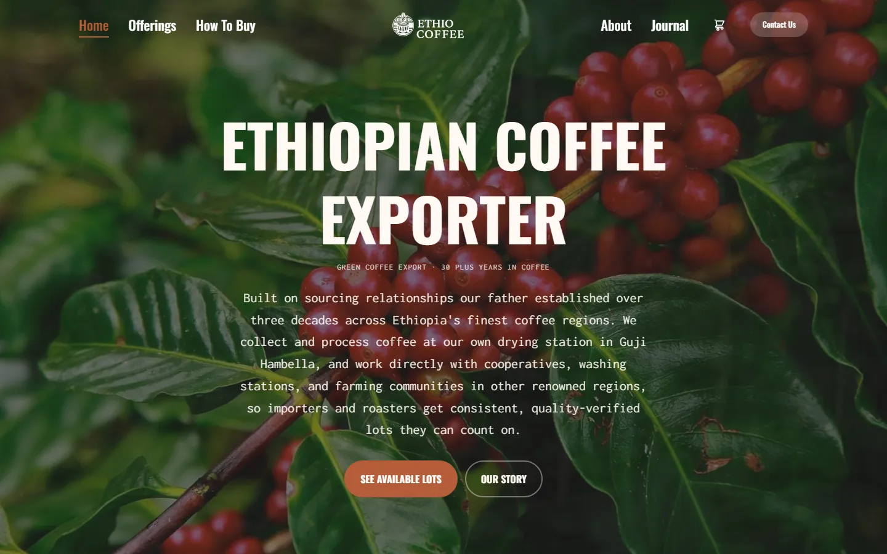

# Ethio Coffee, Ethiopian Green Coffee Export Platform

A production B2B e-commerce and content platform for an Ethiopian green-coffee exporter, built with the Next.js 15 App Router and TypeScript. It handles real online payments, live international shipping quotes, transactional email, and a library of 40+ long-form SEO articles. It runs live on Vercel at **[ethiocoffee.co](https://www.ethiocoffee.co/)**.

> Architecture, payment flow, and security hardening were designed deliberately, then built with a modern AI-assisted workflow (Claude Code, Cursor, GitHub Copilot), including two custom Agent Skills I authored to research, draft, and publish SEO content. See [AI-Assisted Engineering](#ai-assisted-engineering).



## Platform Highlights

- **Online payments.** Full PayPal Orders v2 integration (server-side OAuth, order creation, and capture) with prices validated against the server-side catalog so totals cannot be tampered with from the client.
- **Live shipping quotes.** Real-time international rates from the DHL Express API, calculated by destination and order weight at checkout.
- **Transactional email.** Contact and quote requests delivered via Resend, with HTML-escaped inputs, customer auto-replies, and BCC routing.
- **Dynamic social images.** On-the-fly Open Graph and social cards generated per article with `next/og` and `sharp`, including cached custom font loading.
- **Security-first APIs.** Per-IP rate limiting, strict input validation and sanitization, secret-gated endpoints, and a full set of security headers (HSTS, CSP, `X-Frame-Options`, `Permissions-Policy`).
- **SEO content engine.** 40+ long-form articles and origin guides, a generated sitemap and `robots.ts`, 301 redirect management, and automated IndexNow submission on every production build.
- **Self-serve offer sheets.** Programmatic Excel (`exceljs`) and PDF (`jspdf`) product offer-sheet generation for wholesale buyers.

## Tech Stack

| Area | Technologies |
| --- | --- |
| **Framework** | [Next.js 15](https://nextjs.org/) (App Router, Server Components, Route Handlers) |
| **Language** | [TypeScript](https://www.typescriptlang.org/) |
| **Styling and UI** | [Tailwind CSS](https://tailwindcss.com/), [React Icons](https://react-icons.github.io/react-icons/) |
| **Payments** | [PayPal Orders v2 API](https://developer.paypal.com/) |
| **Shipping** | DHL Express Rate API |
| **Email** | [Resend](https://resend.com/) |
| **Image and OG** | [`next/og`](https://nextjs.org/docs/app/api-reference/functions/image-response), [Sharp](https://sharp.pixelplumbing.com/) |
| **Docs export** | [ExcelJS](https://github.com/exceljs/exceljs), [jsPDF](https://github.com/parallax/jsPDF) |
| **Hosting and Obs.** | [Vercel](https://vercel.com/), Vercel Analytics and Speed Insights, Cloudflare R2 (media) |
| **AI tooling** | Claude Code, Cursor, GitHub Copilot, custom Agent Skills |

## Architecture

Server-side **Route Handlers** under `app/api/` back every integration, keeping all secrets and business logic off the client:

```
app/
├── api/
│   ├── contact/          # Resend email plus rate limiting and sanitization
│   ├── dhl/rate/         # Live DHL Express shipping quotes
│   ├── paypal/           # create-order and capture-order (server-side OAuth)
│   ├── insta/[slug]/     # Dynamic OG and social image generation
│   └── indexnow/         # Secret-gated IndexNow URL submission
├── lib/                  # dhl, indexnow, rate-limit, sanitize, pdfGenerator, layout
├── components/           # Cart, checkout, hero and video, offerings, popups, UI
├── data/                 # Typed catalog, countries, news, offerings
├── checkout/             # Cart and PayPal checkout flow
├── offerings/ , product/ # Product catalog and detail pages
├── insights/ , ethiopia-coffee-export-news/  # 40+ SEO articles
└── sitemap.ts , robots.ts                     # Generated SEO surface
scripts/
└── submit-indexnow.ts    # Runs automatically via postbuild
```

### Engineering notes

- **Tamper-resistant checkout.** Order amounts are recomputed on the server from the canonical catalog before a PayPal order is created. The client never dictates price.
- **Defense in depth on every endpoint.** A shared rate limiter (for example, 5 contact submissions or 15 shipping lookups per IP per minute) plus length caps, type and format validation, and HTML escaping guard each route. Privileged endpoints require a bearer secret.
- **Hardened delivery.** A strict CSP (report-only for tuning), HSTS preload, and clickjacking and MIME-sniffing protections are applied to every response. SVGs are sandboxed.
- **Performance by default.** Next.js image optimization (AVIF and WebP, responsive sizes), route-level `loading.tsx` skeletons, and an error boundary keep the experience fast and resilient.
- **SEO automation.** Production builds regenerate the sitemap and push changed URLs to IndexNow via a `postbuild` script. Legacy domain and URL paths are 301-redirected in `next.config.js`.

## Results

Lighthouse audit of the live homepage (mobile profile, throttled):

| Performance | Accessibility | SEO | CLS |
| :---: | :---: | :---: | :---: |
| 86 | 93 | 100 | 0 |

- **Core Web Vitals (lab):** LCP 3.6s, CLS 0, Total Blocking Time 170ms, First Contentful Paint 1.1s.
- **Content library:** 40+ long-form B2B articles and origin guides, indexed via automated IndexNow submission.

## AI-Assisted Engineering

This project was built with a deliberate, agent-driven workflow rather than ad hoc autocomplete. The most notable piece is a pair of custom Agent Skills I authored to handle SEO content production.

These skills run inside agentic coding tools (Claude Code and GitHub Copilot) as part of my development workflow. They are not part of the shipped application. Each follows a strict, self-verifying procedure.

| Skill | What it does |
| --- | --- |
| `content-creator` | Runs end to end. Given no topic, it audits the existing catalog, researches high-value B2B keywords on the live web, scores candidate topics against SEO and commercial-fit criteria, picks the strongest gap, then drafts, internally links, and registers a publication-ready article for review. |
| `article-rewriter` | A checkpointed variant for rewriting or upgrading a specific article, pausing for approval after research before it drafts. |

Each run is governed by an explicit playbook: competitor analysis on live search results, primary and long-tail keyword mapping, a 60 percent content-uniqueness rule, banned-boilerplate enforcement, internal and external link wiring, a brand style guide, and a final self-review checklist that validates SEO placement and that the TSX compiles. The agent produces a typed Next.js component, registers it in the data layer, updates reading time, and backlinks existing articles, all in one pass before a human review.

The result is the platform's library of 40+ long-form insight and export-news articles, each researched, drafted, and SEO-optimized through this pipeline.

**Tools behind the build**

| Category | Tools |
| --- | --- |
| Agentic coding | Claude Code (Opus 4.x), Cursor, GitHub Copilot |
| Agent infrastructure | Custom Agent Skills, structured skill playbooks, live-web research |
| Workflow | AI-assisted architecture, implementation, and content operations |

## Getting Started

```bash
npm install
npm run dev
```

The app runs at `http://localhost:3000`.

To exercise payments, shipping, and email locally, provide the relevant environment variables (for example `PAYPAL_CLIENT_ID`, `PAYPAL_CLIENT_SECRET`, `PAYPAL_MODE`, `RESEND_API_KEY`, `CONTACT_EMAIL`, DHL credentials, `INDEXNOW_SECRET`) in `.env.local`. Integrations degrade gracefully when their keys are absent.

## Scripts

| Script | Description |
| --- | --- |
| `npm run dev` | Start the development server |
| `npm run build` | Production build (triggers IndexNow submission via `postbuild`) |
| `npm run start` | Serve the production build |
| `npm run lint` | Run ESLint checks |

Set `ANALYZE=true` before `build` to inspect the bundle with `@next/bundle-analyzer`.

## Status

Live in production at **[ethiocoffee.co](https://www.ethiocoffee.co/)**, serving wholesale buyers with a full browse, quote, and pay flow plus an actively maintained content library.

---

Built by **Tofik Mohammed** · [github.com/tofi-124](https://github.com/tofi-124) · [linkedin.com/in/tofikmo](https://www.linkedin.com/in/tofikmo/)
